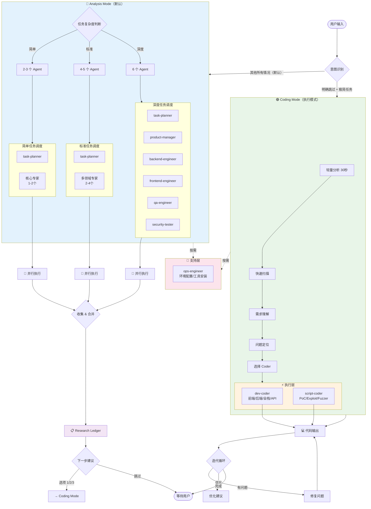
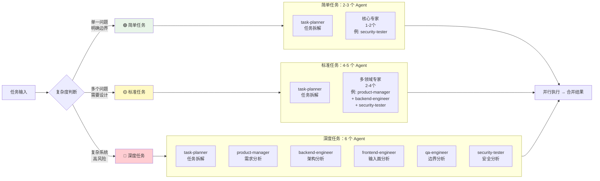
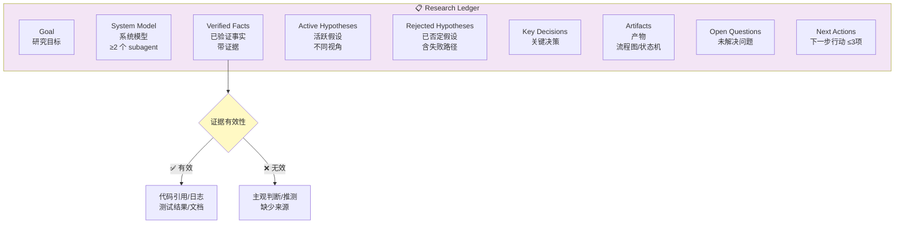
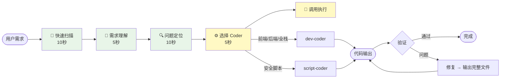

# 多 Agent 团队架构流程图

## 完整调度流程



---

## 分级调度详解



---

## 意图识别决策树

```mermaid
flowchart TD
    Start([用户输入]) --> Q1{任务复杂度?}

    Q1 -->|多模块<br/>需要设计<br/>有风险| Analysis
    Q1 -->|单一功能<br/>< 50行| Q2{需求明确?}

    Q2 -->|模糊<br/>需要澄清| Analysis
    Q2 -->|完全明确| Q3{用户说"直接写"?}

    Q3 -->|是| Q4{用户说"别分析"?}
    Q3 -->|否| Analysis

    Q4 -->|是| Coding
    Q4 -->|否| Analysis

    subgraph Analysis["🔵 Analysis Mode"]
        A1[并行调度分析层 agents]
        A2[输出 Research Ledger]
        A3[提供行动决策选项]
    end

    subgraph Coding["🟢 Coding Mode"]
        C1[轻量分析 30秒]
        C2[调用执行层 coder]
        C3[输出代码]
    end

    Analysis --> Next([等待用户选择])
    Coding --> Loop([迭代优化])

    style Analysis fill:#e3f2fd
    style Coding fill:#e8f5e8
```

---

## Agent 架构总览


---

## Research Ledger 输出结构



---

## 轻量分析流程（Coding Mode）



---

## 数据流向


