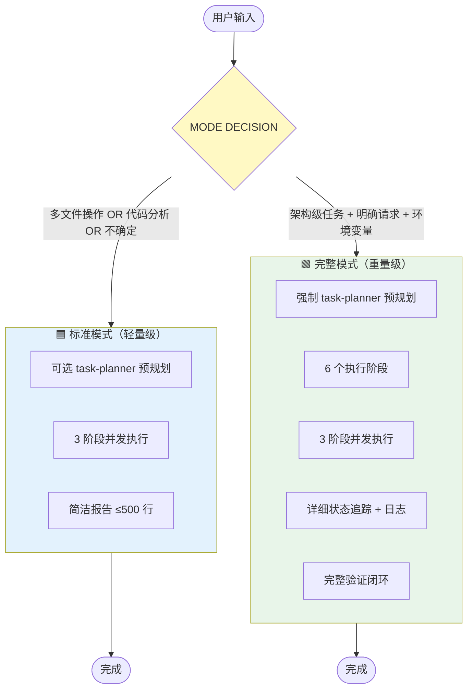
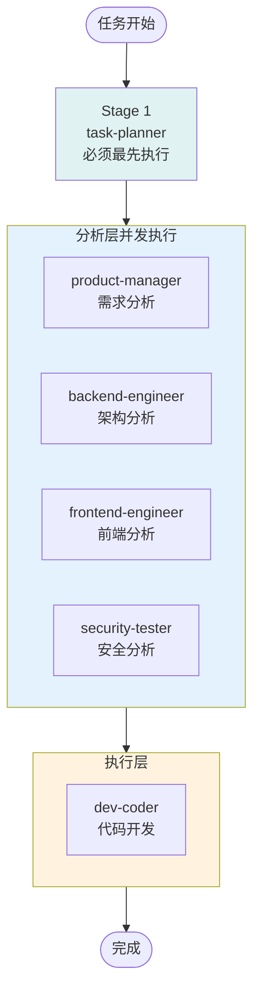
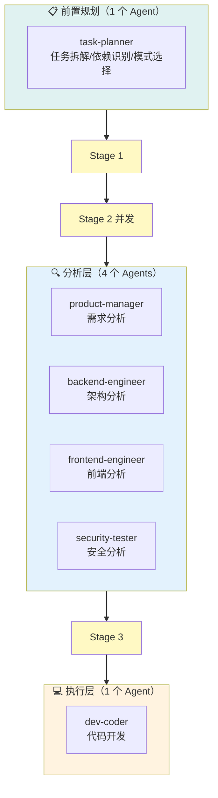
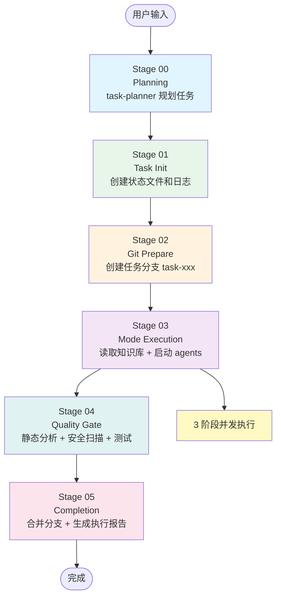
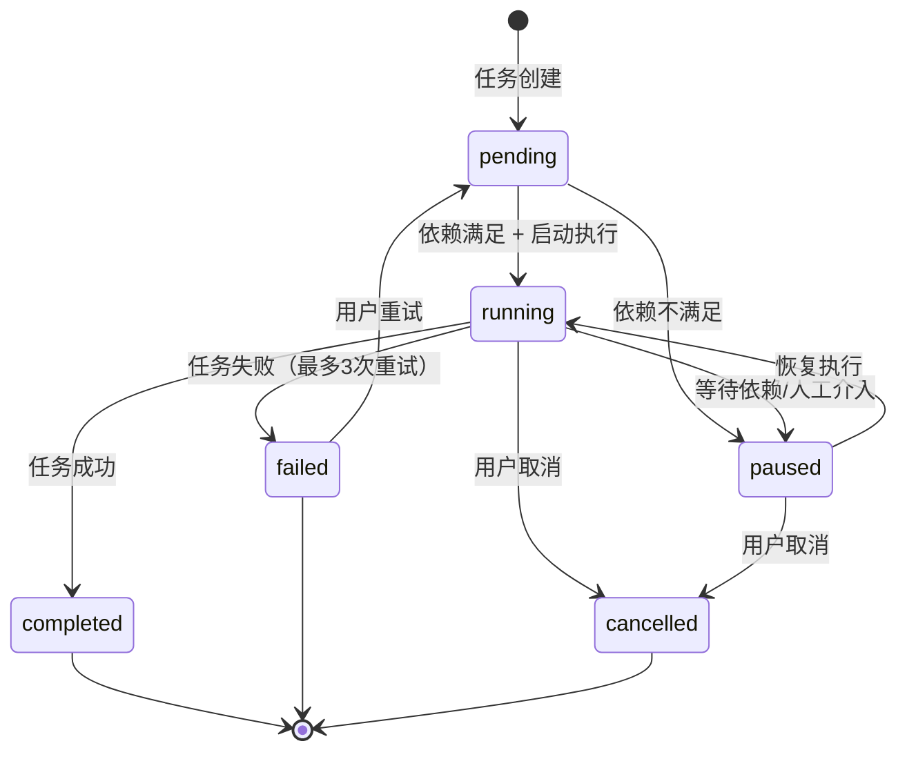
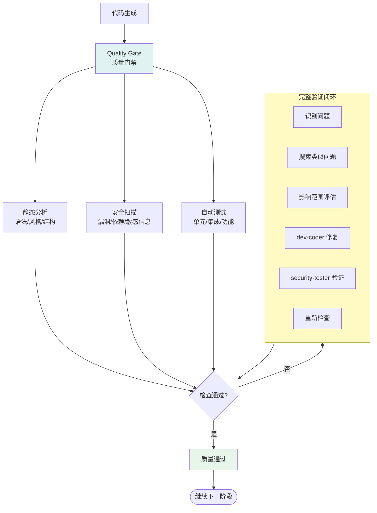
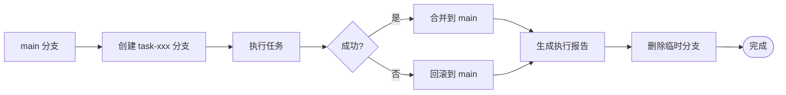

# 多 Agent 团队架构流程图（v2.0.0）

## 系统协议

claudeSandBox 是一个**人为定义的智能任务执行系统**，采用配置驱动的流程编排架构。

### 核心协议

- **唯一真理源**：CLAUDE.md 是唯一入口
- **显式引用**：所有配置文件必须显式读取
- **状态驱动**：状态只能来自文件，支持崩溃恢复
- **支持阶段内并发**：按依赖关系并发执行 agents

详见 `.claude/PROTOCOL.md`

---

## 双模式决策系统



### 模式对比

| 特性 | 标准模式 | 完整模式 |
|------|----------|----------|
| **触发条件** | 默认模式 | `CLAUDE_FULL_MODE=1` |
| **Task Planner** | 可选 | 强制执行 |
| **执行阶段** | 简化流程 | 6 个完整阶段 |
| **并发策略** | 3 阶段并发 | 3 阶段并发 |
| **Agent 超时** | 600 秒 | 600 秒 |
| **状态追踪** | 无 | 完整状态文件 + 日志 |
| **Git 分支** | 不创建 | 自动创建任务分支 |
| **质量门禁** | 可选 | 强制执行 |
| **修复循环** | 建议 | 最多 3 次 + 完整验证闭环 |
| **执行报告** | 简洁报告 | 详细执行报告 |
| **崩溃恢复** | 不支持 | 支持中断恢复 |

---

## 3 阶段并发执行策略



### 并发规则

**Stage 1**（必须最先）：
- `task-planner`：任务拆解、依赖识别、模式选择、资源规划

**Stage 2**（并发执行）：
- `product-manager`：需求与业务目标分析
- `backend-engineer`：系统结构与后端分析
- `frontend-engineer`：前端与用户界面分析
- `security-tester`：安全测试、漏洞扫描、质量验证

**Stage 3**（等分析完成）：
- `dev-coder`：所有代码开发（前端、后端、全栈、API、组件、数据库）

---

## Agent 架构总览



### Agent 职责详解

**前置规划（1 个）**：
- `task-planner`：任务拆解、依赖识别、模式选择、资源规划

**分析层（4 个）**：
- `product-manager`：需求与业务目标分析
- `backend-engineer`：系统结构与后端分析
- `frontend-engineer`：前端与用户界面分析
- `security-tester`：安全测试、漏洞扫描、质量验证

**执行层（1 个）**：
- `dev-coder`：所有代码开发（前端、后端、全栈、API、组件、数据库）

---

## 完整模式：6 个执行阶段



### 阶段职责

| 阶段 | ID | 名称 | 主要职责 |
|------|----|----|---------|
| **任务规划** | 00 | Planning | task-planner 规划任务、拆解、依赖识别 |
| **任务初始化** | 01 | Task Init | 创建状态文件、日志、检查前置条件 |
| **Git 准备** | 02 | Git Prepare | 创建任务分支 task-xxx、初始化 Git |
| **模式执行** | 03 | Mode Execution | 读取知识库、3 阶段并发启动 agents |
| **质量门禁** | 04 | Quality Gate | 静态分析、安全扫描、自动测试、修复循环 |
| **完成管理** | 05 | Completion | 合并分支、生成执行报告、清理临时文件 |

---

## 任务生命周期



### 状态定义

| 状态 | 说明 | 触发条件 |
|------|------|---------|
| **pending** | 等待执行 | 任务创建、依赖未满足 |
| **running** | 正在执行 | 依赖满足、启动执行 |
| **paused** | 暂停等待 | 等待依赖、等待人工介入 |
| **completed** | 执行成功 | 所有阶段完成、质量检查通过 |
| **failed** | 执行失败 | 达到最大重试次数、不可恢复错误 |
| **cancelled** | 用户取消 | 用户主动取消任务 |

---

## 状态文件结构

```
.claude/
├── PROTOCOL.md                    # 协议声明
├── workflow/                      # 流程编排配置
│   ├── standard-mode.md           # 标准模式流程
│   ├── full-mode.md               # 完整模式流程
│   ├── stages/                    # 各阶段配置
│   │   ├── 00-planning.md
│   │   ├── 01-task-init.md
│   │   ├── 02-git-prepare.md
│   │   ├── 03-mode-execution.md
│   │   ├── 04-quality-gate.md
│   │   ├── 05-completion.md
│   │   └── templates/             # 状态文件模板
│   └── agents/                    # Agent 定义
│       ├── task-planner.md
│       ├── product-manager.md
│       ├── backend-engineer.md
│       ├── frontend-engineer.md
│       ├── dev-coder.md
│       └── security-tester.md
├── agent-memory/                  # Agent 持久记忆
│   ├── task-planner/
│   ├── product-manager/
│   ├── backend-engineer/
│   ├── frontend-engineer/
│   ├── dev-coder/
│   └── security-tester/
├── task_logs/                     # 执行日志
│   └── task-{id}.log
├── task_states/                   # 任务状态文件
│   └── task-{id}.json
├── task_plans/                    # 任务规划存储
│   └── task-{id}.json
├── subtask_queues/                # 子任务队列存储
│   └── task-{id}.json
└── task_reports/                  # 执行报告
    └── task-{id}.md
```

---

## 质量门禁与修复循环



### 完整验证闭环

**修复前分析**：
1. 问题模式识别（这个问题属于什么类型？）
2. 类似问题搜索（项目中是否有相同模式？）
3. 影响范围评估（修复会影响哪些功能？）

**执行修复**：
4. 修复所有相关问题（不只是单个问题）
5. 确保修复的一致性

**修复后验证**（security-tester）：
6. ✅ 确认原始问题已修复
7. ✅ 确认所有类似问题已修复
8. ✅ 确认未引入新问题（回归检查）
9. ✅ 确认未破坏现有功能

---

## Knowledge 共享知识库

```
knowledge/
├── patterns.md      # 系统性失败模式（状态、边界、信任、时间、资源、组合）
├── domains.md       # 统一安全问题空间（入侵链、漏洞分类、控制基线）
├── tools.md         # 工具视角认知（选用决策、能力边界、组合工作流）
└── corrections.md   # 错误学习库（常见错误模式与正确修复流程）
```

### 知识库使用规则

**标准模式**：
- 建议读取 relevant knowledge 文件
- 如不读需说明原因

**完整模式**：
- 必须先读取 knowledge 文件再启动 agents
- 禁止跳过知识库读取

---

## Git 分支管理策略



### Git 操作

| 操作 | 命令 | 说明 |
|------|------|------|
| **创建分支** | `git checkout -b task-{id}` | 每个任务独立分支 |
| **提交代码** | `git commit -m "Stage {id}: {name}"` | 按阶段提交 |
| **合并分支** | `git merge --no-ff task-{id}` | 完成后合并到主分支 |
| **回滚** | `git reset --hard {commit}` | 失败时回滚 |

---

## Agent 超时配置

| Agent | 超时时间 | 说明 |
|-------|----------|------|
| **所有 Agents** | 600 秒（10 分钟） | 包括分析和执行层 |

**超时处理**：
- 超时后记录日志
- 询问用户是否继续
- 可选择延长超时或终止任务

---

## 版本历史

### v2.0.0 (2026-03-15)

**重大更新**：
- ✅ 配置驱动的流程编排（6 个执行阶段）
- ✅ 双模式系统（标准模式 + 完整模式）
- ✅ 添加 task-planner 前置规划
- ✅ 3 阶段并发执行策略
- ✅ Agent 超时从 120 秒调整为 600 秒
- ✅ 完整验证闭环（类似问题检查 + 回归检查 + 完整性检查）
- ✅ 任务生命周期管理（pending → running → completed/failed/cancelled/paused）
- ✅ Git 分支管理（每个任务独立分支）
- ✅ 质量门禁（静态分析 + 安全扫描 + 自动测试）
- ✅ Agent 持久记忆（6 个 agent 各自拥有独立的记忆目录）
- ✅ 协议声明（PROTOCOL.md）
- ✅ 移除快速模式（简化为双模式）

**核心变化**：
- 从快速模式 + 标准模式 → 标准模式 + 完整模式
- 从 7 个 agents → 6 个 agents（移除 script-coder 和 ops-engineer）
- 从顺序执行 → 3 阶段并发执行
- 从无状态管理 → 完整的状态持久化
- 从无 Git 管理 → 完整的 Git 分支管理
- 从简单修复 → 完整验证闭环

### v1.1.0 (2026-03-12)

**更新内容**：
- ✅ 移除 "Agent tool" 机制描述
- ✅ 强调并发/并行执行
- ✅ 明确分级调度
- ✅ 添加行动决策框架
- ✅ 添加迭代循环流程

### v1.0.0 (2026-03-11)

**初始版本**：
- 多 Agent 编排系统
- 双模式架构
- 5 个分析层 agents
- 2 个执行层 coder agents
- 1 个支持层 agent
