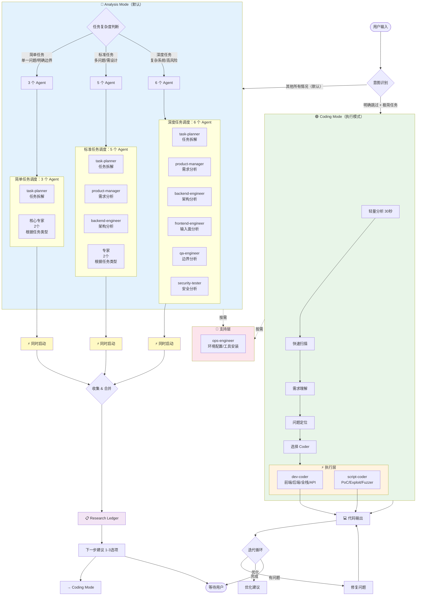
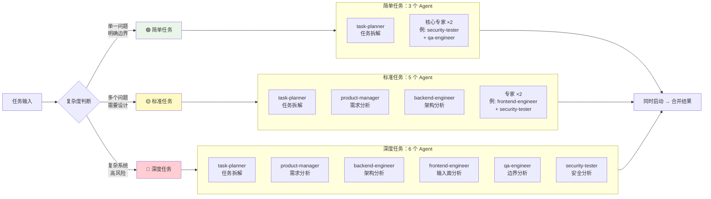
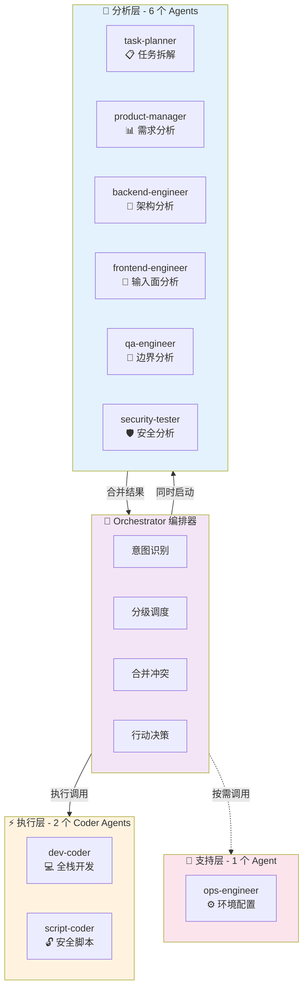
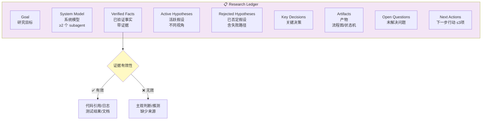
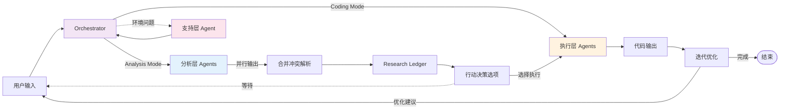

# 多 Agent 团队架构流程图（v1.1.0）

## 完整调度流程



---

## 分级调度详解



**分级判断标准**：

| 等级 | Agent 数量 | 组成 | 适用场景 |
|------|-----------|------|---------|
| **简单任务** | 3 个 | task-planner + 2个核心专家 | 单一问题、边界明确 |
| **标准任务** | 5 个 | task-planner + product-manager + backend-engineer + 2个专家 | 多个问题、需要设计 |
| **深度任务** | 6 个 | 全部分析层 agents | 复杂系统、高风险 |

---

## 意图识别决策树

```mermaid
flowchart TD
    Start([用户输入]) --> Q1{任务复杂度?}

    Q1 -->|多模块<br/>需要设计<br/>有风险| Analysis
    Q1 -->|单一功能<br/>< 50行| Q2{需求明确?}

    Q2 -->|模糊<br/>需要澄清| Analysis
    Q2 -->|完全明确| Q3{用户说"直接写"?}

    Q3 -->|是| Q4{用户说"别分析"?}
    Q3 -->|否| Analysis

    Q4 -->|是| Coding
    Q4 -->|否| Analysis

    subgraph Analysis["🔵 Analysis Mode"]
        A1[同时启动分析层 agents]
        A2[输出 Research Ledger]
        A3[提供行动决策选项]
    end

    subgraph Coding["🟢 Coding Mode"]
        C1[轻量分析 30秒]
        C2[调用执行层 coder]
        C3[输出代码]
    end

    Analysis --> Next([等待用户选择])
    Coding --> Loop([迭代优化])

    style Analysis fill:#e3f2fd
    style Coding fill:#e8f5e8
```

**进入 Coding Mode 的条件**（必须**全部满足）：
1. ✅ 用户明确说："直接写"、"快速实现"、"简单实现"
2. ✅ 任务极其简单：< 50 行代码，单一功能
3. ✅ 用户明确跳过分析："不用分析了"、"别分析"

**典型示例**：
- ✅ "直接写个 hello world" → **Coding Mode**
- ✅ "不用分析了，直接写个简单脚本" → **Coding Mode**
- ❌ "写个用户系统" → **Analysis Mode**（复杂）
- ❌ "做个扫描器" → **Analysis Mode**（需求不明确）
- ❌ "这个代码有问题吗" → **Analysis Mode**（需要分析）

---

## Agent 架构总览



**Agent 职责详解**：

**分析层（6 个）**：
- `task-planner`：任务拆解、优先级排序、依赖识别、资源规划
- `product-manager`：需求与业务目标分析
- `backend-engineer`：系统结构与状态机分析
- `frontend-engineer`：输入面与攻击面分析
- `qa-engineer`：失败路径与边界场景分析
- `security-tester`：攻击路径与漏洞分析

**执行层（2 个）**：
- `dev-coder`：所有代码开发（前端、后端、全栈、API、组件、数据库）
- `script-coder`：安全脚本（PoC、Exploit、Fuzzer、扫描工具）

**支持层（1 个）**：
- `ops-engineer`：环境配置、工具安装、系统调试、依赖管理

---

## Research Ledger 输出结构



**字段说明**：

| 字段 | 说明 | 来源 |
|------|------|------|
| **Goal** | 研究目标 | 用户输入 |
| **System Model** | 系统模型 | 来自 ≥2 个 subagent |
| **Verified Facts** | 已验证的事实 | 仅接受带证据输出 |
| **Active Hypotheses** | 活跃假设 | 来自不同视角 subagent |
| **Rejected Hypotheses** | 已否定的假设 | 必须包含失败路径 |
| **Key Decisions** | 关键决策 | 合并后的决策 |
| **Artifacts** | 产物 | 流程图、状态机等 |
| **Open Questions** | 未解决问题 | 待澄清的问题 |
| **Next Actions** | 下一步行动 | ≤3 项 |

**证据有效性标准**：

| 类型 | 示例 | 有效性 |
|------|------|--------|
| **✅ 有效证据** | 代码引用（文件:行号）、日志输出、测试结果、文档引用 | 可接受为 Verified Facts |
| **❌ 无效证据** | 主观判断（"我认为"）、无根据推测、缺少来源的陈述 | 放入 Active Hypotheses |

---

## 轻量分析流程（Coding Mode）


**轻量分析步骤**（30 秒内完成）：

1. **快速扫描**（10 秒）：读取用户提到的文件/代码，快速浏览上下文
2. **需求理解**（5 秒）：明确用户要做什么（修复 bug、添加功能、写新代码）
3. **问题定位**（10 秒）：找到问题行/位置，或确定新代码应该插入的位置
4. **选择 Coder**（5 秒）：根据任务类型选择 dev-coder 或 script-coder
5. **启动执行**：立即启动相应 coder，附带上下文信息

**轻量分析场景**：
- 用户指出 bug：→ 读取文件 → 定位 bug → 启动 coder 修复
- 用户要新功能：→ 理解现有代码 → 启动 coder 添加
- 用户要 PoC：→ 理解目标 → 启动 script-coder

---

## 数据流向



---

## 行动决策（Analysis Mode 完成后）

Analysis Mode 完成后，必须给出明确的下一步建议（1-3 个可执行选项）：

### 行动决策模板

```markdown
## 分析完成 - 下一步建议

根据分析结果，我建议以下下一步行动：

**选项 1**：[具体行动]
- 描述：[详细说明]
- 需要的 Agent：[agent 名称]
- 预计时间：[估算]

**选项 2**：[具体行动]
- 描述：[详细说明]
- 需要的 Agent：[agent 名称]
- 预计时间：[估算]

**选项 3**：[具体行动]
- 描述：[详细说明]
- 需要的 Agent：[agent 名称]
- 预计时间：[估算]

**跳过**：暂不执行，等待进一步指示

**请选择**：[1] [2] [3] [跳过] [自定义]
```

### 典型行动决策场景

**场景 1：发现漏洞**
```
选项 1：编写 SQL 注入 PoC（script-coder，15分钟）
选项 2：编写修复建议文档（dev-coder，10分钟）
选项 3：深入分析漏洞影响范围（security-tester，10分钟）
```

**场景 2：架构评审完成**
```
选项 1：实现状态恢复机制（dev-coder，30分钟）
选项 2：完善权限判断逻辑（dev-coder，20分钟）
选项 3：编写架构文档（dev-coder，15分钟）
```

**场景 3：任务拆解完成**
```
选项 1：开始执行子任务 T1（同时启动相关 agent）
选项 2：调整任务优先级（重新启动 task-planner）
选项 3：等待用户确认（暂不执行）
```

**场景 4：分析完成但无明确行动**
```
选项 1：输出分析报告（Markdown 格式）
选项 2：继续深入分析 [某个方面]
选项 3：等待用户指示
```

---

## 迭代循环（Coding Mode 完成后）

Coding Mode 完成代码输出后，进入迭代循环：

### 1. 代码验证

**自动检查项**：
- ✅ 语法正确性
- ✅ 逻辑完整性
- ✅ 错误处理覆盖
- ✅ 边界条件处理

**验证方式**：
- 静态分析：检查代码逻辑
- 动态验证：如果可以，建议运行验证
- 边界测试：测试输入边界情况

### 2. 问题识别

如果发现问题，进入修复循环：
- **语法错误**：直接修复
- **逻辑错误**：分析并修复
- **边界问题**：补充处理

### 3. 优化建议

代码可用后，给出优化建议（如果有）：
- **性能优化**：性能瓶颈、优化方向
- **安全优化**：安全风险、加固建议
- **代码质量**：可读性、可维护性
- **最佳实践**：更好的实现方式

### 4. 迭代完成标志

当满足以下条件时，迭代循环完成：
- 代码可直接运行
- 没有明显的错误或问题
- 已给出必要的优化建议（如有）

**迭代循环模板**：

```markdown
## 代码输出完成

### 验证结果
✅ 语法检查通过
✅ 逻辑验证通过
⚠️ 发现 [问题类型]

### 优化建议
[如果有明显的优化机会]

### 下一步
1. 确认代码可用
2. 如果有问题，请指出具体问题，我会修复
```

---

## 版本历史

### v1.1.0 (2026-03-12)

**更新内容**：
- ✅ 移除 "Agent tool" 机制描述
- ✅ 将 "并行调度" 改为 "同时启动"（更清晰的命令式语言）
- ✅ 将 "调用" 统一改为 "启动"
- ✅ 强调并发/并行执行，而非机制细节
- ✅ 明确分级调度：简单（3个）/ 标准（5个）/ 深度（6个）
- ✅ 添加行动决策框架
- ✅ 添加迭代循环流程

**核心变化**：
- 从 "并行调度"（parallel dispatch）→ "同时启动"（concurrent start）
- 强调**同时启动**所有需要的 subagents，而非串行或依赖特定工具机制

### v1.0.0 (2026-03-11)

**初始版本**：
- 多 Agent 编排系统
- 双模式架构（Analysis Mode / Coding Mode）
- 6 个分析层 agents
- 2 个执行层 coder agents
- 1 个支持层 agent
